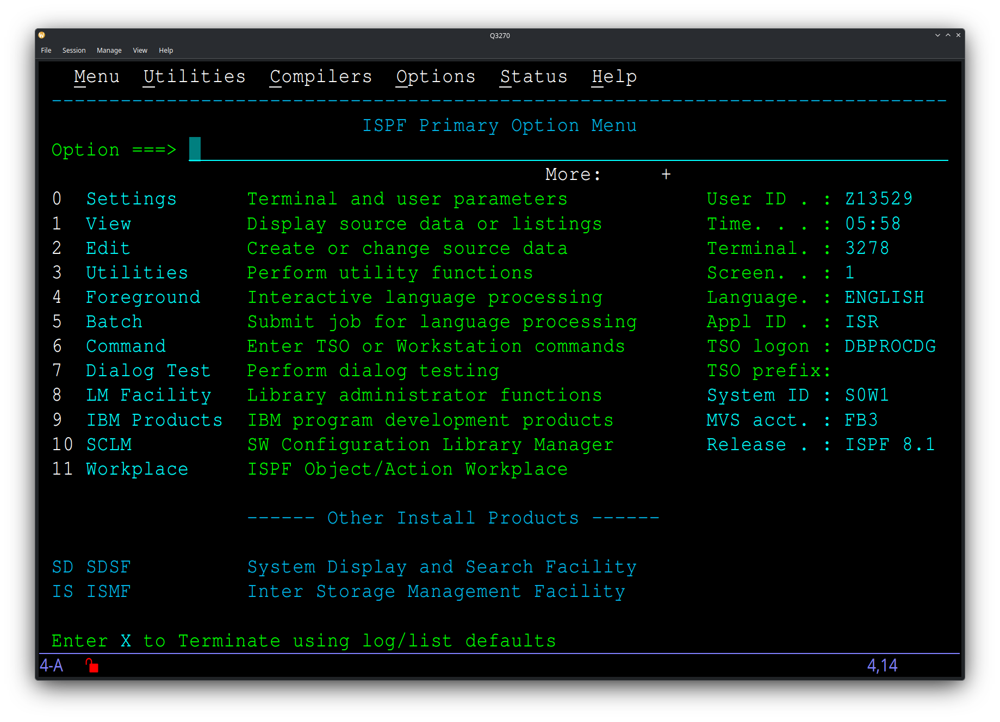

# Q3270 — A Qt-based TN3270 Emulator

Q3270 is a TN3270 terminal emulator for accessing IBM mainframe systems running MVS, z/OS, VM/CMS
and related operating systems. Built with Qt, it runs on Linux and macOS.



---

## Features

- Standard 3270 model sizes plus IBM-DYNAMIC user-selectable screen dimensions
- Colour theme editor with full 3179 field attribute colour mapping
- Keyboard mapping dialog
- Session management — save, load, and auto-start session lists
- Dynamic font scaling to fit the window
- SSL/TLS support

---

## Installation

### Linux

Install Qt 5.15 development libraries via your package manager, then build from source:

**Ubuntu/Debian:**
```
sudo apt install build-essential qtbase5-dev qttools5-dev-tools libqt5svg5-dev
```
**Fedora:**
```
sudo dnf install qt5-qtbase-devel qt5-qtsvg-devel
```
**openSUSE:**
```
sudo zypper install libqt5-qtbase-devel libqt5-qtsvg-devel
```
**Arch Linux:**
```
sudo pacman -S base-devel qt5-base qt5-svg
```

Then:
```
git clone https://github.com/HobbitHacker/Q3270.git
cd Q3270
cmake .
make
./Q3270
```

### macOS

```
brew tap HobbitHacker/q3270
brew install q3270
```

---

## Documentation

Full documentation is at [https://hobbithacker.github.io/Q3270](https://hobbithacker.github.io/Q3270).

---

## Licence

BSD 3-Clause. See [LICENSE](LICENSE) for details.
